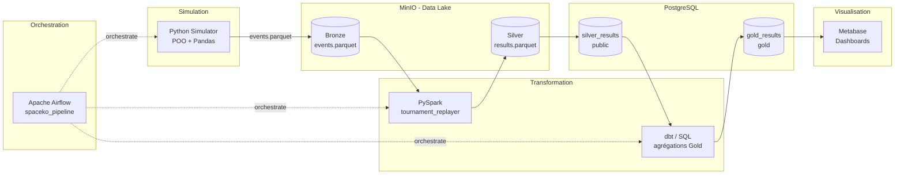
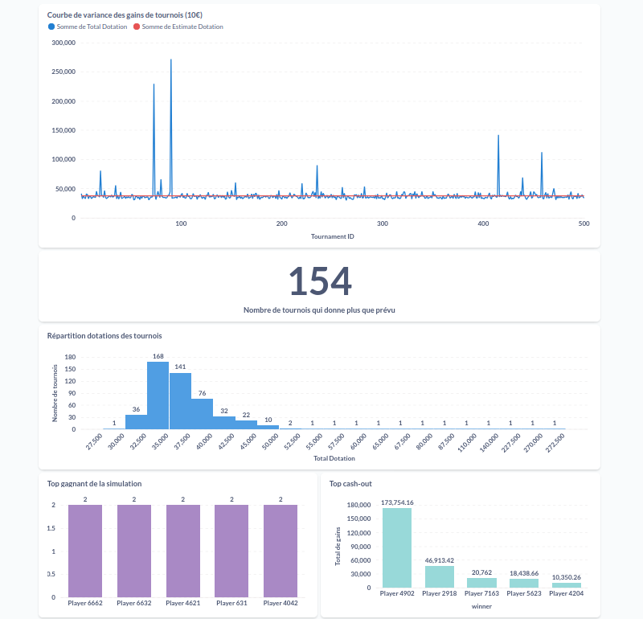
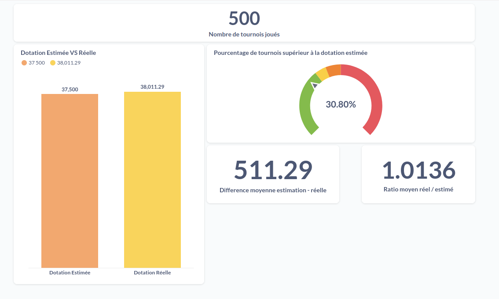

# SpaceKO - Pipeline ETL Data End-to-End


## Description

Simulation de tournois SpaceKO (Winamax) et pipeline ETL complet pour répondre à une question analytique métier :

> **La dotation réelle distribuée dépasse-t-elle la dotation estimée ?**

## Architecture



## Stack technique

| Couche | Technologie |
|---|---|
| Simulation | Python (POO), Pandas |
| Data Lake | MinIO (S3-compatible), architecture Medallion |
| Transformation | PySpark, dbt |
| Orchestration | Apache Airflow |
| Stockage | PostgreSQL |
| Visualisation | Metabase |
| Infrastructure | Docker, Docker Compose |

## Lancer le projet

```bash
docker compose up -d 
```
Accès :

- Airflow : http://localhost:8080
- Metabase : http://localhost:3000
- MinIO : http://localhost:9001

## Dashboards


